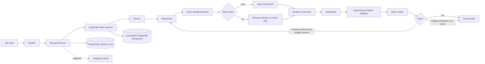

# Production-Ready AI Research Agent

## Overview

This project is an evidence-grounded web research API built with FastAPI and LangGraph. Given a research question, it creates a structured plan, executes independent web searches concurrently, normalizes and ranks the evidence, writes a cited answer, verifies its claims, and performs bounded targeted research when evidence is missing.

A single LLM call is not enough for this workflow: the model does not have reliable access to current web information, one prompt cannot safely coordinate multiple tool calls and retries, and free-form answers provide no deterministic way to validate source identifiers. The agent separates planning, retrieval, synthesis, and verification into explicit stages with typed state and execution budgets.

The repository is a portfolio-scale v1.0.0 implementation. It demonstrates production-oriented design patterns; it does not claim production traffic, availability, or scale.

## Architecture



`ResearchService` supplies the run ID as LangGraph's `thread_id`, applies the recursion limit, records run metadata, and optionally creates the root Langfuse observation. LangGraph owns the workflow state and conditional retry route.

## End-to-End Research Workflow

```text
User Query
  → Planner
  → Research Plan
  → Parallel Tool Execution
  → Evidence Collection
  → Normalize / Deduplicate / Rank
  → Grounded Synthesis
  → Citation Validation
  → Claim Verification
  → PASS or Targeted Retry
  → Final Answer
```

The planner returns two to five typed research steps. The researcher runs pending steps concurrently with `asyncio.gather`. Evidence is deduplicated by normalized URL, ranked by Tavily relevance score, capped by `MAX_SOURCES`, and reassigned stable IDs such as `src-1`. The synthesizer may use only the supplied evidence. The verifier combines deterministic citation checks with LLM-based claim assessment, then the router either finishes or sends only missing-evidence queries back to the researcher.

## Key Engineering Features

- **Structured outputs:** Pydantic models constrain research plans, synthesis results, evidence, claim assessments, verification results, and API payloads.
- **LangGraph state machine:** `ResearchState` makes plan, evidence, answer, verification, retry queries, errors, iterations, and tool usage explicit.
- **Asynchronous research:** independent plan steps are searched concurrently instead of serially.
- **Dependency injection:** node factories accept the LLM, search tool, limits, and evidence settings; `create_app` can inject a test graph.
- **Deterministic citation validation:** a regex extracts `[src-x]` references and Python checks them against the available evidence IDs.
- **Claim-level verification:** the verifier evaluates important claims against supplied evidence and rejects unsupported evidence IDs.
- **Backend-calculated coverage:** Python calculates `supported_claims / total_claims`; the LLM cannot choose the score.
- **Targeted retry:** only verifier-generated missing-evidence queries are searched on retry.
- **Bounded execution:** maximum iterations, maximum tool calls, and a LangGraph recursion limit independently cap work.
- **Search cache:** Redis caches normalized query plus result-count responses for a configurable TTL.
- **Persistence:** PostgreSQL stores API-facing run metadata; a separate LangGraph checkpointer stores graph state.
- **Tracing:** optional Langfuse integration wraps the research run and attaches LangChain/LangGraph callbacks for model and graph observations.

## Reliability Design

| Failure mode | Control in this repository |
|---|---|
| Infinite verification loop | `max_iterations`, `max_tool_calls`, and `GRAPH_RECURSION_LIMIT` all stop further routing. |
| Repeated useless research | retries use only deduplicated `missing_queries`; no retry occurs when the verifier supplies none. |
| Invented source IDs | citation IDs are checked against current evidence, and verifier evidence IDs are filtered against the same set. |
| Unsupported claims | claim-level assessment marks unsupported claims and contributes to the backend coverage score. |
| Excessive tool usage | the researcher slices active steps to the remaining tool-call budget. |
| One Tavily search fails | tool errors are abstracted as `ToolExecutionError`; the failed step is recorded while sibling searches still complete. |
| Redis is unavailable or contains invalid data | cache reads degrade to misses and cache writes are skipped; live search can continue. |
| Graph execution fails | the run is marked `failed` in `research_runs` before the exception reaches FastAPI. |

When verification still fails after the permitted work, the graph returns the latest answer and a `passed=false` verification object rather than claiming success. API `status="completed"` means execution completed; it does not mean verification passed.

## Why LangGraph?

LangGraph represents each stage and transition explicitly, persists state through a checkpointer, supports async node execution and callbacks, and provides a recursion guard. A custom `while` loop could implement the happy path, but checkpointing, conditional routing, observability integration, and testable state transitions would all become application-specific control-flow code.

## Why deterministic citation validation?

Whether `[src-7]` exists in the current evidence set is a deterministic membership test. Using an LLM would add cost, latency, and non-determinism to a rule Python can evaluate exactly. The LLM is retained for the semantic question—whether evidence actually supports a claim—not identifier validation.

## Why backend-calculated verification coverage?

The verifier returns structured per-claim decisions. The backend then calculates:

```text
coverage_score = supported_claims / total_claims
```

This makes the threshold reproducible and prevents a model from returning an arbitrary self-assigned score. If the verifier extracts no claims, coverage is `0.0`.

## Why targeted retry?

Rerunning the original plan would repeat successful searches, increase cost, and often retrieve the same evidence. The verifier instead emits up to `MAX_TARGETED_QUERIES` concise queries for unsupported claims. Existing evidence is retained, new results are merged and deduplicated, and the tool and iteration budgets still apply.

## Persistence

The two PostgreSQL responsibilities are intentionally separate:

1. **`research_runs` metadata** is application-owned and API-facing. It records the run ID, query, status, timestamps, latency, tool calls, iterations, source count, verification score, and failure text. `GET /v1/research/{run_id}` reads this table.
2. **LangGraph checkpoints** are framework-owned execution snapshots keyed by the run ID supplied as `thread_id`. They preserve graph state and support inspection or future resume workflows.

Metadata is a stable product-level summary; checkpoints are detailed orchestration state. Keeping them separate prevents API contracts from depending on LangGraph's storage schema.

## Redis Caching

The cache stores serialized Tavily evidence for a normalized search query and `max_results`. The default TTL is **900 seconds (15 minutes)** and is configurable through `REDIS_CACHE_TTL_SECONDS`.

`research_step_id` is deliberately excluded from the key because the same query result can be reused by different runs or plan steps. On a hit, every cached evidence item is copied and assigned the current step ID and a new raw source ID. Stable `src-x` IDs are assigned later, after global deduplication and ranking.

## Observability

When `LANGFUSE_ENABLED=true`, `ResearchService` creates a root `research-agent` observation containing the run ID and query. The Langfuse callback handler is passed into LangGraph, allowing graph and LLM activity—including planner, synthesis, verifier, and repeated graph passes—to appear under the run. The root output records verification status, tool-call count, and iteration count. The Langfuse client is shut down during FastAPI lifespan cleanup so buffered events are flushed.

The custom Tavily HTTP client is not currently instrumented as its own Langfuse child span; tool usage is visible through graph execution and aggregate run metrics. This is listed as a future observability improvement rather than overstated here.

## API

### `GET /health`

Liveness only; it does not access dependencies.

```json
{"status":"ok"}
```

### `GET /ready`

Checks PostgreSQL and Redis. It returns HTTP 503 with per-dependency booleans when either is unavailable.

```json
{"status":"ready","postgres":"ok","redis":"ok"}
```

### `POST /v1/research`

The request is synchronous: the HTTP response is held until the graph completes or fails.

```bash
curl -X POST http://localhost:8001/v1/research \
  -H 'Content-Type: application/json' \
  -d '{
    "query": "Compare edge and cloud inference for generative AI applications",
    "max_iterations": 2
  }'
```

Shape of a successful execution response (values abbreviated, not benchmark output):

```json
{
  "run_id": "2d953c1e-27ba-4bd8-9832-74a872909047",
  "status": "completed",
  "query": "Compare edge and cloud inference for generative AI applications",
  "plan": [
    {
      "id": "step-1",
      "question": "What are the latency and privacy tradeoffs?",
      "rationale": "Establish deployment tradeoffs.",
      "status": "completed"
    },
    {
      "id": "step-2",
      "question": "What are the cost and capability tradeoffs?",
      "rationale": "Compare operational constraints.",
      "status": "completed"
    }
  ],
  "answer": "The report contains evidence-grounded claims [src-1].",
  "sources": [
    {
      "source_id": "src-1",
      "research_step_id": "step-1",
      "source_type": "web",
      "title": "Example source title",
      "url": "https://example.com/source",
      "content": "Retrieved evidence excerpt.",
      "relevance_score": 0.91,
      "published_date": null
    }
  ],
  "verification": {
    "passed": true,
    "coverage_score": 1.0,
    "citation_valid": true,
    "cited_source_ids": ["src-1"],
    "invalid_citations": [],
    "unsupported_claims": [],
    "claims": [
      {
        "claim": "The report contains an evidence-grounded claim.",
        "supported": true,
        "evidence_ids": ["src-1"],
        "reason": "The supplied evidence directly supports the claim."
      }
    ],
    "missing_queries": []
  },
  "metrics": {
    "tool_calls": 3,
    "iterations": 1,
    "sources_found": 10,
    "latency_ms": 13250,
    "errors_count": 0
  }
}
```

### `GET /v1/research/{run_id}`

Returns persisted run metadata, not the full final answer or checkpoint state.

```bash
curl http://localhost:8001/v1/research/2d953c1e-27ba-4bd8-9832-74a872909047
```

```json
{
  "run_id": "2d953c1e-27ba-4bd8-9832-74a872909047",
  "query": "Compare edge and cloud inference for generative AI applications",
  "status": "completed",
  "started_at": "2026-09-16T15:00:00Z",
  "completed_at": "2026-09-16T15:00:13Z",
  "latency_ms": 13250,
  "tool_calls": 3,
  "iterations": 1,
  "sources_found": 10,
  "verification_score": 1.0,
  "error": null
}
```

## Tech Stack

| Area | Technology |
|---|---|
| Runtime/API | Python 3.12, FastAPI, Pydantic |
| Agent orchestration | LangGraph, LangChain |
| LLM adapters | Google Gemini, OpenAI, deterministic mock mode |
| Web retrieval | Tavily, async HTTPX |
| Persistence | PostgreSQL, psycopg pool, LangGraph PostgreSQL checkpointer |
| Cache | Redis |
| Observability | Langfuse |
| Quality | Pytest, Ruff, 30-query evaluation harness |
| Delivery | Docker, Docker Compose, GitHub Actions |

## Project Structure

```text
app/
├── agent/       # graph, state, nodes, prompts, routing, citation validator
├── api/         # FastAPI routes and request/response schemas
├── core/        # environment-backed settings
├── db/          # PostgreSQL pool and research_runs repository
├── llm/         # provider factory
├── models/      # Pydantic domain models
├── services/    # research orchestration and Redis cache
└── tools/       # Tavily web-search adapter and tool error abstraction
evals/           # 30-query dataset, runner, and canonical report
tests/           # unit, API/graph integration, and infrastructure tests
docs/            # evaluation, review, CV, and interview material
```

## Local Development

1. Install [uv](https://docs.astral.sh/uv/), then install the locked dependencies:

   ```bash
   uv sync --locked --dev
   ```

2. Create local configuration:

   ```bash
   cp .env.example .env
   ```

   For live research, set `LLM_PROVIDER=google`, choose a compatible Gemini `LLM_MODEL`, and add `GOOGLE_API_KEY` and `TAVILY_API_KEY`. Keep `LLM_PROVIDER=mock` for dependency-free API and graph tests. Do not commit `.env`.

3. Start PostgreSQL and Redis:

   ```bash
   docker compose up -d postgres redis
   ```

4. Start FastAPI:

   ```bash
   uv run uvicorn app.main:app --reload --port 8000
   ```

5. Check liveness and readiness:

   ```bash
   curl http://localhost:8000/health
   curl http://localhost:8000/ready
   ```

## Docker

Build and start the complete stack:

```bash
cp .env.example .env
docker compose up --build -d
docker compose ps
curl http://localhost:8001/health
curl http://localhost:8001/ready
```

The image uses the locked dependency set, excludes local virtual environments and secrets through `.dockerignore`, and runs as the non-root `appuser`.

## Testing

```bash
uv run ruff check .
uv run pytest -q
RUN_INFRA_TESTS=1 uv run pytest tests/integration/test_persistence.py -q
```

The default suite covers models, evidence processing, citation validation, routing budgets, targeted retry, cache behavior, service persistence behavior, graph execution, and API validation. The opt-in infrastructure tests require PostgreSQL and verify both `research_runs` persistence and LangGraph checkpoint persistence. CI starts PostgreSQL and Redis, runs lint and both test layers without Gemini or Tavily credentials (`LLM_PROVIDER=mock`), and builds the Docker image.

## Evaluation

The canonical report is [`evals/reports/latest.json`](evals/reports/latest.json), generated on 2026-09-16 from 30 questions across technology landscapes, comparisons, company strategy, AI engineering, agents, observability, and production AI. Each case defines minimum source and coverage requirements; success also requires a non-empty answer, valid citations, and a passing verification result.

| Metric | Recorded value |
|---|---:|
| Total / completed queries | 30 / 30 |
| Completion rate | 100.00% |
| Research success rate | 93.33% |
| Citation validity | 93.33% |
| Verification pass rate | 93.33% |
| Average claim support | 100.00% |
| Tool success rate | 100.00% |
| Retry rate | 0.00% |
| Average iterations | 1.00 |
| Average tool calls | 3.13 |
| p50 latency | 13,250.50 ms |
| p95 latency | 48,912.75 ms |

Two cases (q01 and q05) completed with sufficient sources and `coverage_score=1.0` but failed citation validation. Both recorded `invalid_citations=[]`, which indicates missing recognized citations rather than invented source IDs. The report does not contain answer text or per-node timings, so a deeper root cause cannot be claimed. See [Evaluation Analysis](docs/evaluation.md) for the case-level review and benchmark limitations.

Run the harness against a live API with:

```bash
uv run python -m evals.run_eval --base-url http://localhost:8001
```

Timestamped report history is gitignored; `latest.json` is retained as the canonical portfolio result.

## Failure Handling

- Tavily transport, HTTP, response-decoding, and evidence-validation errors become `ToolExecutionError` values handled per research step.
- Failed steps produce no evidence but do not cancel successful sibling searches.
- Redis cache failures degrade to cache misses or skipped writes.
- No-evidence synthesis returns an explicit insufficiency message.
- No-evidence verification fails with coverage `0.0` and requests a targeted search for the original query.
- Malformed LLM structured output or an unexpected graph error fails the request and marks persisted run metadata as `failed`.
- Exhausted iteration, tool-call, or recursion budgets stop further work.
- Readiness returns 503 when PostgreSQL or Redis is unavailable; liveness remains independent.

## Design Decisions

| Decision | Reason |
|---|---|
| LangGraph over a manual loop | explicit nodes and routing, persisted state, callbacks, and recursion protection |
| Deterministic citation IDs | exact validation without model cost or uncertainty |
| LLM semantic verifier | support is a meaning-level judgment that simple string rules cannot make |
| Backend coverage calculation | reproducible metric derived from structured claim decisions |
| Targeted retry | retains useful evidence and limits repeated search cost |
| Redis | short-lived reuse of equivalent external searches with graceful degradation |
| PostgreSQL metadata | durable API-facing run status and metrics |
| PostgreSQL checkpoints | durable framework execution state keyed by `thread_id` |
| Dependency injection | replaceable nodes and graph for focused tests |
| Async execution | lower wall-clock time for independent I/O-bound searches |
| Structured outputs | typed boundaries and early validation of model responses |

## Limitations

- Retrieval quality and freshness depend on Tavily and the web pages it surfaces.
- The semantic claim verifier is still LLM-based and can make incorrect support judgments.
- Ranking uses provider relevance scores; there is no independent authority, primary-source, or domain-quality scorer.
- Web evidence is untrusted. The verifier prompt explicitly tells the model to ignore embedded instructions, but prompt injection remains a risk for synthesis and verification.
- Citation validation proves that IDs exist, not that every claim is placed next to the correct citation. The semantic verifier is a separate control.
- The 30-query benchmark is small, topic-skewed, and based on one recorded run. It is not a general quality or load benchmark.
- `POST /v1/research` is synchronous and can hold an HTTP connection for tens of seconds; recorded p95 latency is about 48.9 seconds.
- The API has no authentication, authorization, rate limiting, or frontend.
- Langfuse callback tracing does not yet create a dedicated span around each custom Tavily HTTP call.
- Checkpoints are persisted and inspectable, but the public API does not expose a resume endpoint.

## Future Improvements

- Add source-quality scoring, domain allow/deny policies, and stronger primary-source preference.
- Add a citation-repair/resynthesis path when evidence is sufficient but citations are missing.
- Add human approval for sensitive or high-impact research.
- Move long research runs to a background-job API with polling or streaming status.
- Add richer retrieval tools for first-party documents, academic papers, and structured data.
- Track per-provider token cost and per-node latency.
- Add authentication, rate limiting, content-size limits, and stronger prompt-injection defenses.
- Instrument Tavily calls and cache outcomes as explicit Langfuse spans.
- Expand and repeat the benchmark across model versions, query types, and adversarial cases.
